## ITDB: IT项目无数据库IT资产管理软件  

**注意，此项目官方已不再维护，现由爱好者pyccl维护**

关于
=====

描述
-----------

ITDB是一个基于网络的资产库存管理工具，用于存储在办公环境中发现的资产信息，重点是不限于IT资产。它不是ITIL/CMDB法规遵从性的目标，但它为我服务了多年，希望它也能为您服务:-)  
ITDB附带源代码，在GNU公共许可证下发布。  

安全性
--------

请不要把ITDB暴露在公众的网络上。它是不安全的，它是针对内部网的。如果您需要这样做，请至少使用https并在您的web服务器上配置一个HTTP auth密码，这样它将隐藏在密码后面。

待办事项
----
官方已经不再维护，现在由pyccl进行维护。BUG修复、功能增加等。

* 采购订单管理
* 基本票务支持
* 每个项目/软件的配置/知识/常见问题条目。(比附加文件更容易)
* RRD支持历史图表趋势
* 平面图中的项目定位，带拖放功能(WIP)
* 更好的(分析性)许可模型、SLA事件、重复事件、描述
* 自动主机和软件发现-数据库审计
* 类似ISO20000的功能

特性
--------

* **硬件**: 规格、保修、序列号、IP信息、与该硬件相关的其他硬件、项目状态、事件日志、受托人
* **软件**: 规格，许可证信息，...
* **关联**: 每个软件的安装位置、许可证数量、组件关系、与软件/硬件/发票的合同关系
* **发票**: 描述日期、供应商、价格、附加文件的购买证明
* **代理商**: 供应商、软硬件制造商、买方(针对不同的Dpt)、承包商
* **位置**: 每项资产的位置:建筑、楼层、房间、机柜、机架、深度
* **合同**: 定义自定义合同类型，如支持和维护、SLA等。跟踪合同事件。
* **标签**: 硬件和软件的多个标签。您可以根据用途、预算、所有者、重要性等使用标签进行分组。
* **文件**: 将文档附加到每个主要对象实体（项目、软件、发票、合同等）
* **用户**: 谁拥有什么或谁对什么负责（现已经只有登录功能）
* **机柜**: 显示机柜布局，包括分配给每个U的硬件。(支持多个硬件/机柜)。
* **打印标签:** 打印标签贴纸，用于标记您的所有资产，无论有无二维码，从电话、笔记本电脑、冷却装置、ups。通过GUI轻松定义新的标签纸布局（新增支持自定义纸张大小）。
* **一键式备份**: 从主菜单中获得ITDB安装和数据的完整备份。要恢复，只需提取网络服务器上的备份文件！
* **所有页面都可以打印**: 所有屏幕页面/列表/报告打印出来很好，没有菜单，滚动条和其他杂物。
* **界面翻译**: 翻译文件支持。您可以创建自己的翻译(1.3版)
* **基本的LDAP支持**: 从LDAP URL提取项目分配的用户列表。(未经active directory测试，也不用于身份验证。

下载
--------

当前官方版本:  
6/Mar/2016 version 1.23: [itdb-1.23.zip](https://github.com/sivann/itdb/archive/1.23.zip)  
4/Jul/2015 version 1.22: [itdb-1.22.zip](https://github.com/sivann/itdb/archive/1.22.zip)  
2/Jul/2015 version 1.21: [itdb-1.21.zip](https://github.com/sivann/itdb/archive/1.21.zip)  
25/Oct/2014 version 1.14: [itdb-1.14.zip](https://github.com/sivann/itdb/archive/1.14.zip)  
~20/Oct/2014 version 1.13: This version had some unreleased code by mistake.  
~23/Dec/2013 version 1.12: [itdb-1.12.tar.gz](itdb-1.12.tar.gz)  
24/Oct/2013 version 1.11: [itdb-1.11.tar.gz](itdb-1.11.tar.gz)  
~22/Oct/2013 version 1.10: (wrong db version bundled)  
~28/Sep/2013 version 1.9: [itdb-1.9.tar.gz](itdb-1.9.tar.gz)  
  
您可以在[GitHub](https://github.com/sivann/itdb)上下载当前的开发版本  
  
以前的版本在[这里](releases_old/?C=M;O=D).  

演示
----

[DEMO](demo/itdb-1.23/)是**只读**的，功能有限。演示可能有点慢，这是由于我的供应商，而不是由于itdb。

许可证
-------

该软件是在GPL下发布的。我会很高兴收到一封描述你如何使用它的电子邮件！  

链接
-----

* [GitHub](https://github.com/sivann/itdb)
* [Freshmeat/Freecode](http://freecode.com/projects/itdb)
* [ohloh](https://www.ohloh.net/p/itdb)

截图
-----------

部分截图来自之前的版本。  
一些截图已经被编辑删除私人信息。  

[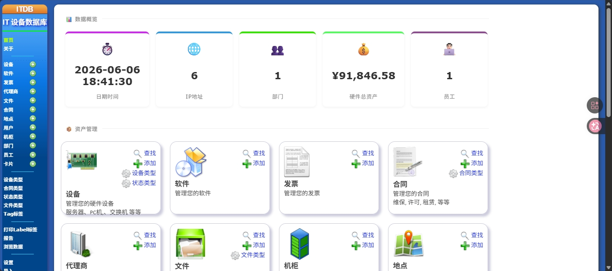   首页](images/pyccl/home.png)

[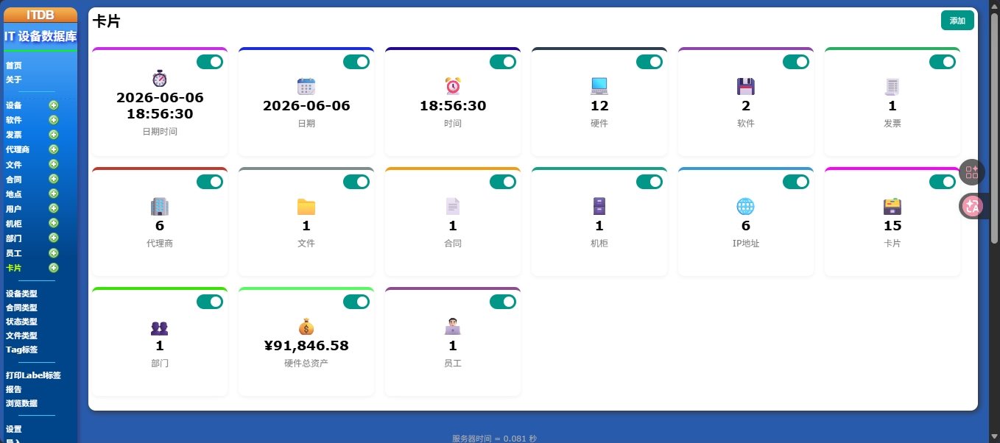   卡片列表](images/pyccl/listcard.png)

[   部门列表](images/pyccl/listdepartment.png)

[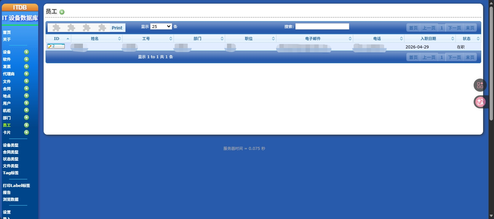   员工列表](images/pyccl/listemploy.png)

[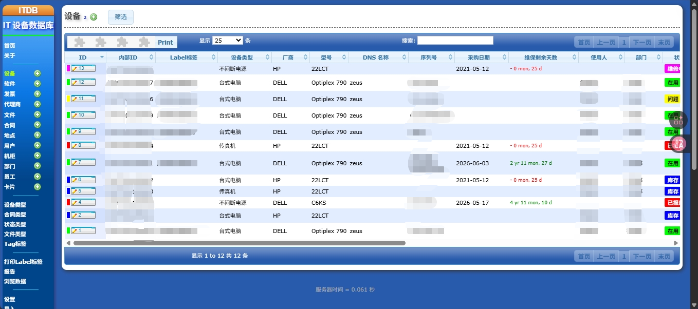   硬件列表](images/pyccl/listitem.png)

[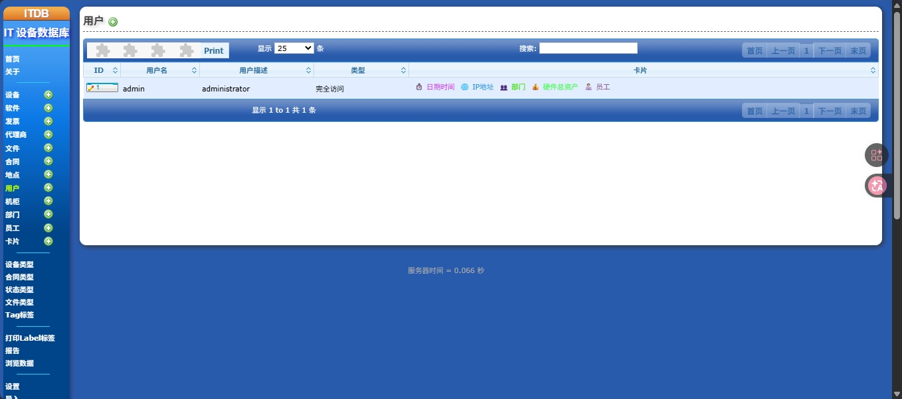   用户列表](images/pyccl/listuser.png)

[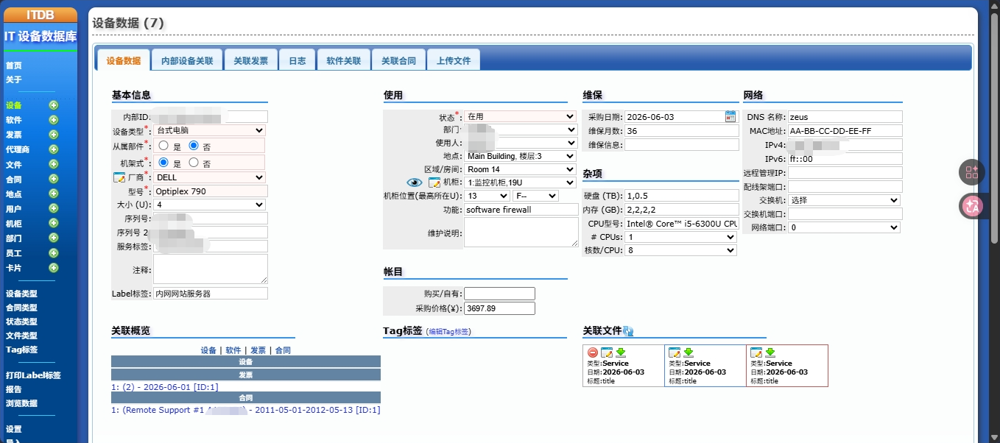   编辑硬件](images/pyccl/edititem.png)

[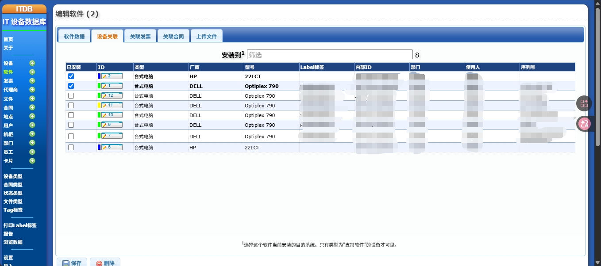   关联硬件](images/pyccl/associationitem.png)

[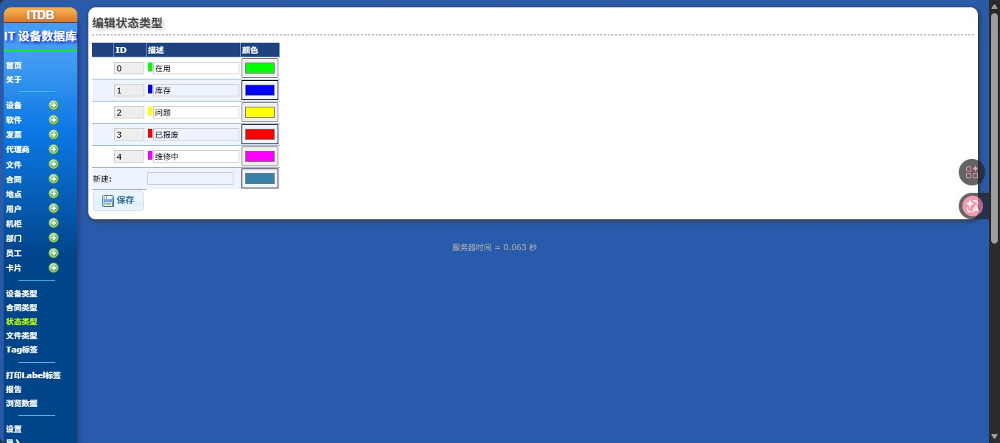   状态类型](images/pyccl/statustype.png)

[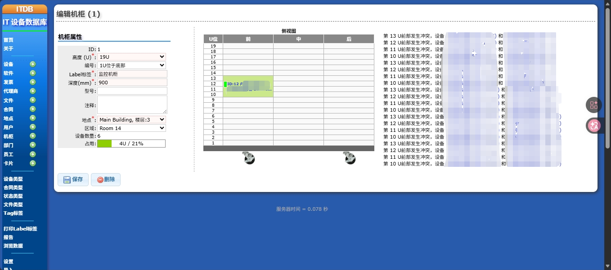   编辑机柜](images/pyccl/editrack.png)

[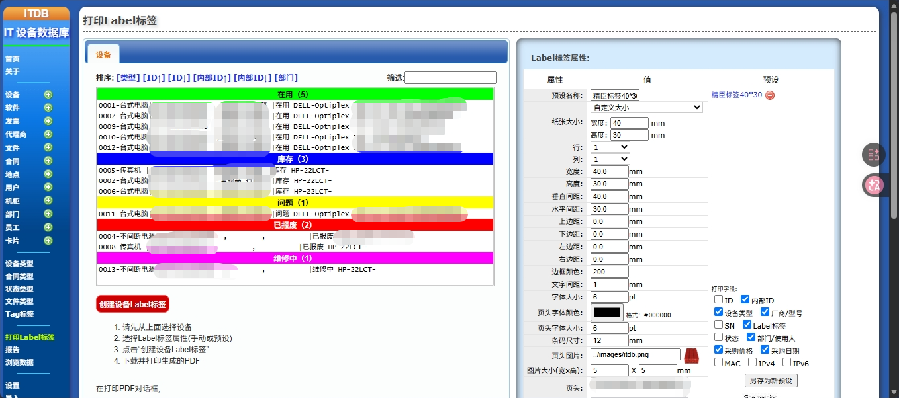   标签打印](images/pyccl/printlabel.png)

[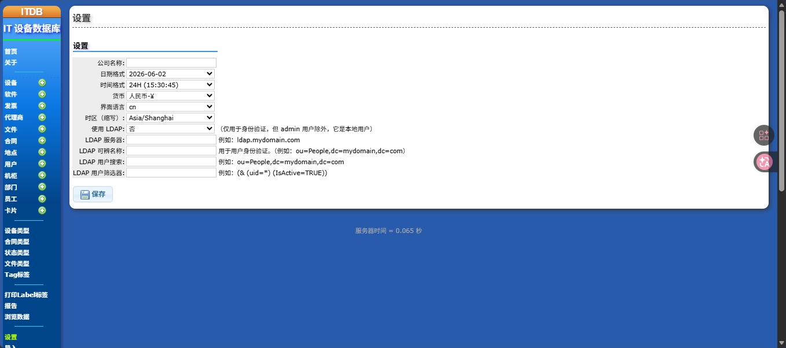   系统设置](images/pyccl/setting.png)

[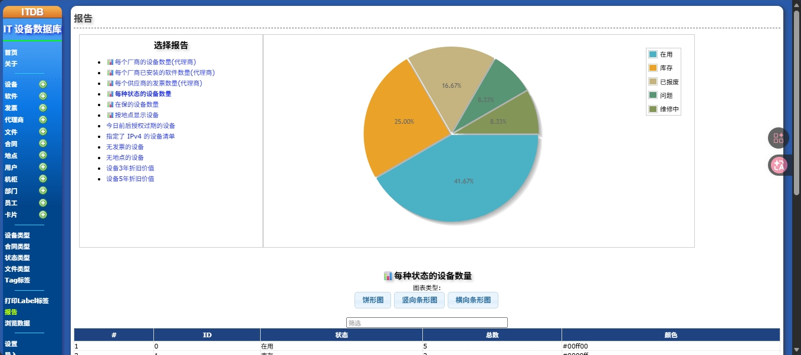   报告-饼图](images/pyccl/reportpie.png)

[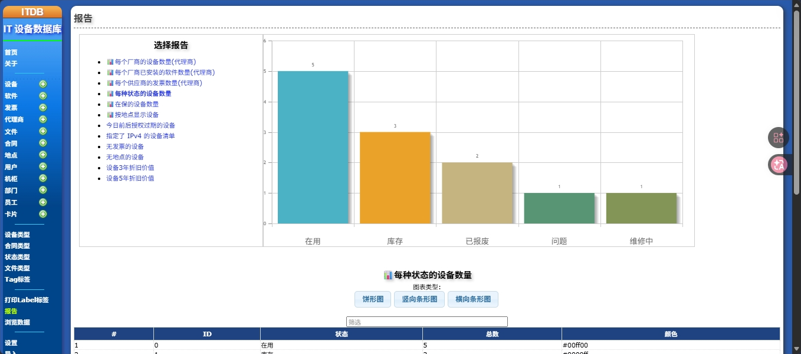   报告-条形统计图1](images/pyccl/reportline1.png)

[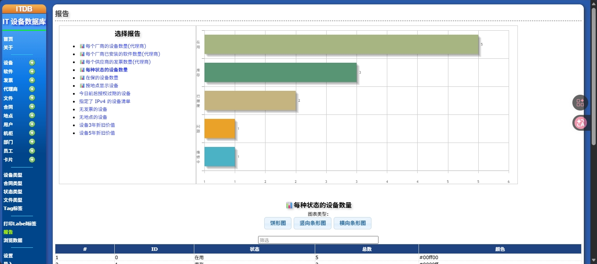   报告-条形统计图2](images/pyccl/reportline2.png)

[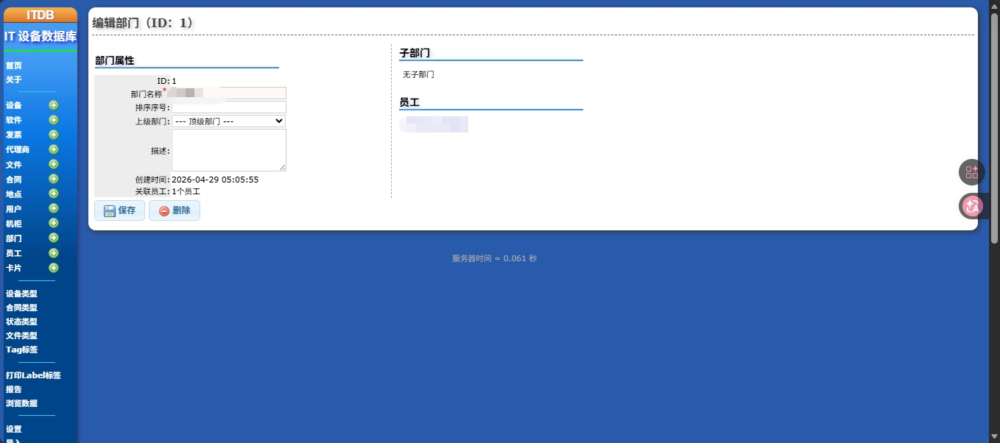   编辑部门](images/pyccl/editdepartment.png)

[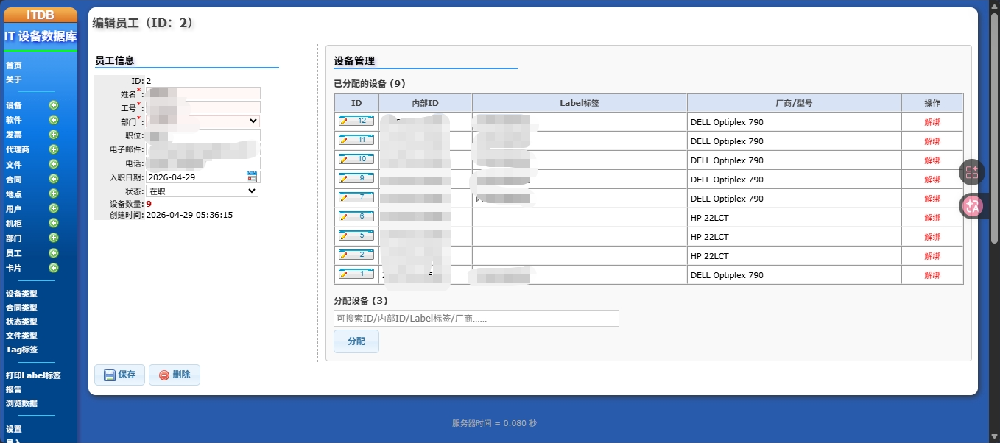   编辑员工](images/pyccl/editemploy.png)

[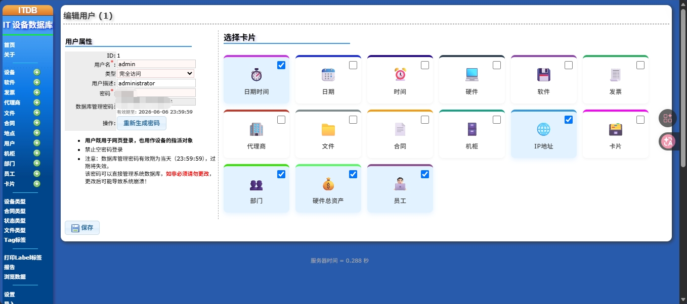   编辑用户](images/pyccl/edituser.png)

[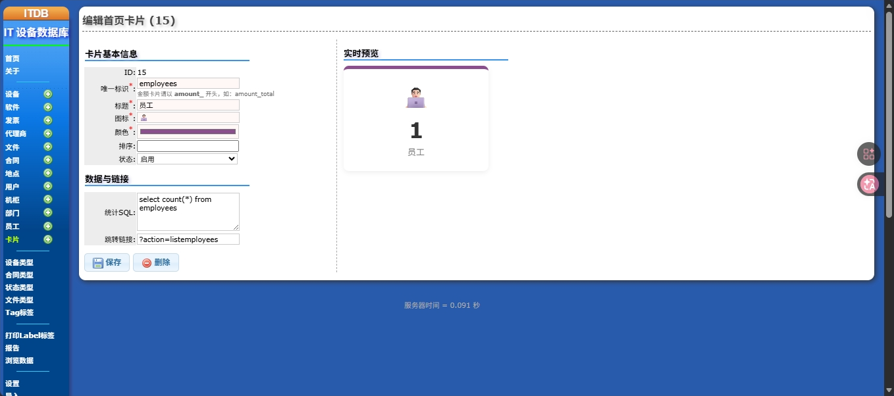   编辑卡片](images/pyccl/editcard.png)

[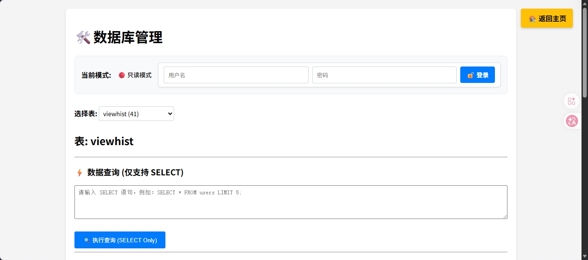   数据库管理](images/pyccl/dbmanager.png)

安装
============

系统需求
-------------------

* 火狐、Chrome、EDGE等或IE≥9的最新版本
* posix系统(linux、solaris等)上的Apache 2.2(Apache 2.0也可以工作)
* PHP版本 > 5.2.x，并且PHP版本 < 7.0。
* PHP SQlite PDO, SQlite >3.6.14.1
* 根据您的发行版，您可能还需要安装软件包"php-posix", "php-mbstring", "php5-gd", "php5-json" "php5-sqlite" "php-pdo"

据我所知，它也可以在Windows系统下运行，但我无法测试它。

安装说明
-------------------------

1.  将文件提取到web导出的目录中(在“DocumentRoot”下)
2.  将pure.db重命名为itdb.db (pure.db是一个空白数据库)
（**注意**：更新我的非官方版本后，需要执行/a.php进行数据库结构的更新）
3.  使data/itdb.db文件**和**data/ 目录**和**data/files/ 可由web服务器读写
4.  使 translations/ 目录对web服务器可读和可写
5.  使用**admin/admin**登录

如果您需要找到apache/php安装所使用的sqlite库，请浏览到itdb/phpinfo.php或按下itdb菜单左下方的蓝色小图标(I)。

升级
-------

说明文件位于00-UPGRADE.txt中

发布说明
-------------

较旧的 CHANGELOG 在 [这里](https://github.com/sivann/itdb/commits/master)  
对于较新的版本，您可能会看到[提交日志](https://github.com/sivann/itdb/commits/master)  

Copyright © 2008-2016 Spiros Ioannou - printmail('gmail.com','sivann');
# 首页 
http://www.sivann.gr/software/itdb/

# 贡献
请考虑到我的空闲时间现在非常有限，因此即使是有效的拉取请求也可能在很长一段时间内无法得到解决。

# 状态
由于我没有足够的时间来改进ITDB，我只能为较新的PHP或浏览器版本提供错误修复。请不要要求新功能。
 
# 安全
请勿将ITDB暴露于公共互联网。它不安全，它是针对内联网的。如果你需要这样做，请在你的web服务器上配置一个HTTP身份验证密码，这样它就会隐藏在密码后面。
 
## 拉取请求的范围
感谢您抽出时间考虑捐款。请注意，ITDB只是一个库存软件。它可以通过查询提供一些基本的报告
它自己的数据，因为它可以访问发票、用户和设备。
ITDB试图坚持 [做一件事](https://en.wikipedia.org/wiki/Unix_philosophy#Do_One_Thing_and_Do_It_Well) 哲学。
ITDB没有也不应该旨在提供其他软件的功能，例如网络监控工具、财务软件或网络诊断软件。

## 拉取请求的程度 
Pull请求应该修复1并且只修复1件事。否则，很难进行测试和审查。

### BUG修复
提交bug时，请花时间考虑以下几点：
* 你的补丁如何处理非美国字符？（例如中文、希腊文等）
* 您的修复程序如何处理非美国地区？（尤其是日期操纵修复）
* 你的修复程序使用strtotime吗？（不要使用它）
* 你的修复程序如何处理旧的SQLite版本？ 
* 您的修复程序如何处理较旧/较新的PHP版本？ 
* 你的修复程序如何与Firefox/Chrome/EDGE/IE配合使用？
* 你的补丁如何适应大量的项目？

### 新的UI字段拉取请求：
在提交通用拉取请求时，请花时间考虑以下因素：
* 你的新领域普遍有用吗？你能想到没有意义的情况吗？
* 当前字段是否已经解决了您的功能？
* 您的领域是否有特定的搜索需求？

如果上述至少一项的答案为否，那么您可能不需要该字段。ITDB在“否”类别中有很多字段，我们不要再添加了。

## 欢迎拉取请求
欢迎任何修复以下问题的pull请求。请在开始编码之前展开讨论。

### 主要贡献
* 使用PDO（和准备好的语句）重写DB请求
* 使用服务器端AJAX的数据表重写项目关联表
* 将数据表更新为最新版本
* 使用框架（例如slim）重写前端控制器和身份验证
* 非常简单的票务
 
### 捐赠
#### UI
* 项目用户选择和其他可能的选择：使用jqueryui的自动补全组合框代替下拉选择
* 就地编辑/添加项目类型、代理、用户。可配置为允许对特定用户进行编辑/添加，并为其他用户进行选择。
* 在位置中设计PC/服务器布局。将项目分配给图像映射上的x/y
* 编辑上一项/下一项功能。例如，从搜索结果的项目列表中。 
* 将文件上传器替换为最近也支持拖放的文件上传器
* 统一标签关联代码

### 模式
* 在软件中添加历史记录（续订）和事件，就像在项目中一样。
* 服务和项目关系列表
* 虚拟/非虚拟项目（例如VM）。父（物理）项。虚拟可能会显示为家长机架位置的工具提示。此外
* 添加知识区域，与项目和软件（文本）连接
* 软件类（类型）。例如O/S
* 在contrib/中添加一个cron通知示例脚本，用于合同/保修到期
* 许可证型号：库存数据：每次安装、OEM和机器许可。外部数据源：合格的桌面、CPU、用户、命名用户、服务器、客户端访问许可证（CAL）、站点、企业和用户定义模型。TBD。
* 端口连接管理（如果需要，待定）
* 电源线管理（如果需要，待定）

感谢！
